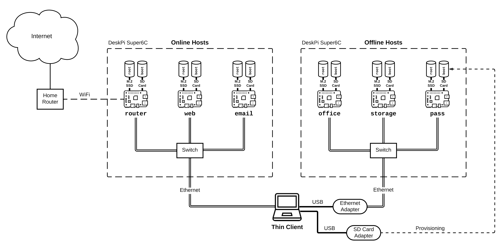
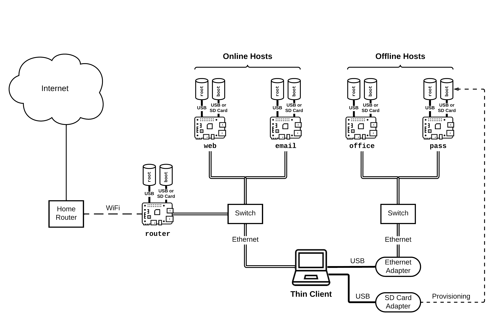

# Hardware

TowerOS is designed to run on a thin client device and several hosts connected _via_ one or two unmanaged Ethernet switches. Two switches are necessary if the user would like to have offline as well as online hosts.

## Thin Client Hardware
The thin client is typically a laptop like the Lenovo X270. The thin client should have an SD card reader for provisioning SD cards that the hosts will boot from if you are using CM4s. (Raspberry Pi 4Bs may be booted from a second USB key, however.) The thin client should also have one or two RJ-45 ports, depending on the number of networks in use.

## Networking Hardware
- DeskPi Super6C when using Compute Module 4 Lites *or* Netgear unmanaged switches when using Raspberry Pi 4Bs
- Olimex USB Ethernet Adapter (https://www.olimex.com/Products/USB-Modules/USB-GIGABIT/open-source-hardware)
- One Ethernet cable per host.

## Host Hardware
TowerOS currently supports two kinds of host hardware: Raspberry Pi 4B and Compute Module 4 Lite (“CM4” for short). Whereas Raspberry Pi 4Bs must be connected with standalone switch hardware, CM4 modules may be connected with a board like the DeskPi Super6C, which provides for a much more compact form factor for a complete TowerOS system. CM4 modules may easily use M.2 SSDs as their persistent storage _via_ a DeskPi Super6C, and they should therefore perform much better.

*Notes*
- The amount of RAM required for each host is heavily dependent on the intended usage pattern. Generally, at least one host should have 8GB of RAM, to run a web browser. For the router host, we recommend having at least 2GB of RAM.
- Different SD cards and USB keys may have very different performance characteristics. In general, USB keys are much faster than SD cards, and M.2 SSDs are faster still.
- Each host needs two storage devices to function properly: one for the boot filesystem and another for the root filesystem (the one that contains your applications and data). The root filesystem is fully encrypted and the key to decrypt it is located in the boot filesystem. If you are using Raspberry PI 4b, you can use either an SD card or a USB key for each file system (It is recommended to use the fastest device for the root file system). For CM4s with a DeskPi, on the other hand, you must use an SD card for the boot file system and an M.2 SSD for the root file system.

### Compute Module 4 Lite

Using CM4s and the [DeskPi Super6C Board](https://deskpi.com/collections/deskpi-super6c/products/deskpi-super6c-raspberry-pi-cm4-cluster-mini-itx-board-6-rpi-cm4-supported) you can avoid most cables and put all your hosts in a single mini-ITX case. This setup is **more performant, more affordable and more compact**. However, it is also more difficult to debug: the DeskPi only provides USB and HDMI access to slot #1 on the board, and hosts cannot be power cycled individually. To support both online and offline hosts, two independent DeskPi Super6s should be used; otherwise, a single DeskPi will support five online hosts plus the router.

#### Requirements
- Only the CM4 *Lite* is supported.
- Only the CM4 Lite module used for the router must have on-board WiFi (the others may be entirely wireless).
- CM4s must be booted from an SD card, which will hold the boot partition.
- Accordingly, you must have an SD Card reader for the thin client.
- CM4s must use an M.2 SSD for the root partition.

### Raspberry Pi 4B

Using standard Raspberry Pi 4Bs for your system is most appropriate if it does not need to be portable, because of the additional bulk of the Raspberry Pi form factor. If you wish to support offline hosts, then you need two unmanaged switches; otherwise, one will do.

#### Requirements
- You will need either two USB keys, or one USB key and one SD card per host. (For best performance, the root partition should reside on a fast USB key, which should be plugged into the blue USB 3.0 port.)
- If you are using a PoE switch, you will need one PoE hat per host; if not, a USB hub may be used for power delivery.
- You will need one RTC Clock hat for each offline host.

## Hardware for Debugging
* Monitor
* micro HDMI adapter
* USB Keyboard
* USB Mouse
