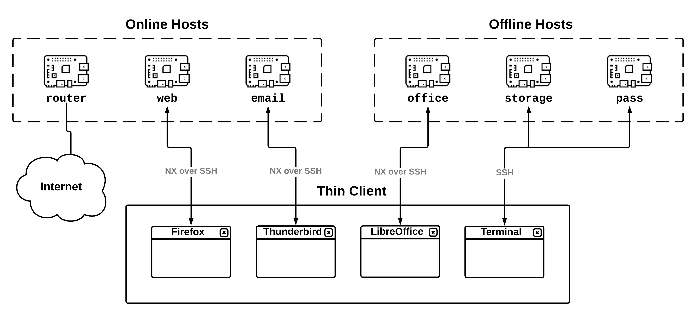

# Introduction

**TowerOS** is an operating system for combining *multiple, independent computers* into a single high-assurance system for high-value targets and paranoid individuals. TowerOS is an example of a *converged multi-level secure (MLS) computing system*, similar to [Qubes OS](https://www.qubes-os.org/); but whereas Qubes OS takes a single computer and splits it into multiple security domains, TowerOS does the reverse—each security domain is relegated to a separate, dedicated **host** (e.g. a Raspberry Pi), and the user accesses their applications from a **thin client** (e.g. a laptop) over a LAN using standard network protocols (namely, SSH and NX), with strict firewall rules governing all network communication. The different security domains are by default completely independent, and all communication across security boundaries is under the direct control of the user.

In contrast to existing designs, Tower offers theoretically greater security guarantees, better usability, and more flexibility. The downside is that you need multiple computers to make it work. However, with the development of cheap, powerful and small single-board computers (SBCs), it's now quite practical to carry half a dozen computers with you wherever you go. For a more formal description of the design of TowerOS, including a detailed comparison with Qubes OS, please refer to **[the whitepaper](TowerOS%20Whitepaper.pdf)**.

TowerOS is completely open-source and freely licensed. All TowerOS source code, as well the sources used to generate this documentation, is hosted on the **[TowerOS GitHub repository](https://github.com/towercomputers/toweros)**.

