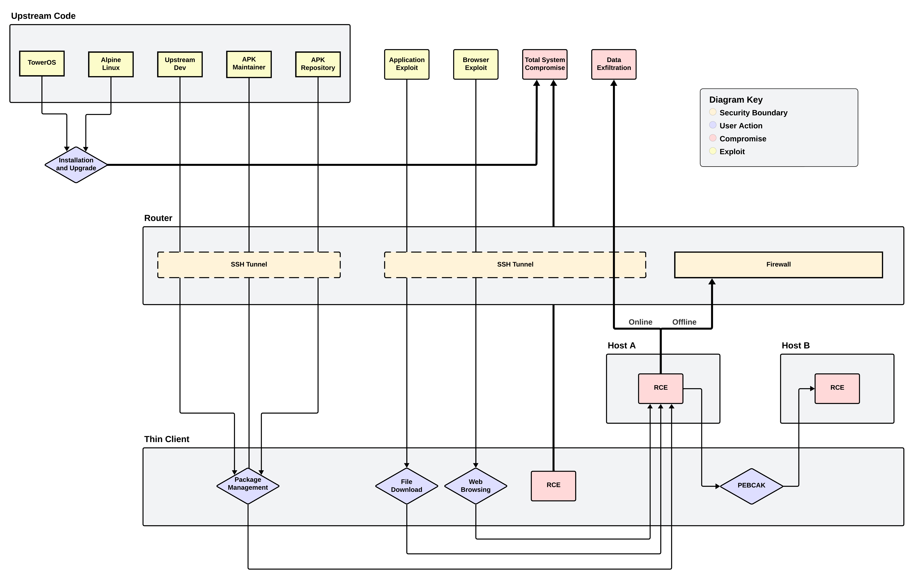

## Security Model

- Direct communication between hosts is forbidden.
- Incoming connections to the thin client are forbidden.
- All communication with a host must originate with the thin client and be:
	- over SSH,
	- on port 22, and
	- *via* Ethernet.
- All communication between the thin client and a host must be directly triggered by user action.
- SSH tunnels from the thin client or an online host to the Internet, through the router, are allowed.
- Risks of data compromise by device theft are mitigated using encryption of the root filesystem of every host. However, for usability reasons, it's not practical to require passphrase input on each boot—the decryption key is stored on a separate boot device, and the user may remove this device when leaving the host hardware unattended.


## Operating System
In general, operating system configuration is outside the scope of TowerOS's responsibilities; TowerOS does attempt to be *secure by default*, however. Of course, the core architecture of TowerOS is designed to mitigate the severity of any compromise of a host. For information on how best to securing your thin client and hosts at the level of the operating system, please see this [Linux Hardening Guide](https://madaidans-insecurities.github.io/guides/linux-hardening.html).

## Thin-Client Security
The thin client is the root of trust of the system. To avoid accidentally compromising the thin client, avoid installing unnecessary software and never open any untrusted files, except on a host.

## Router Security
Best practice is never to install any software on the router host, nor open any untrusted files on it either.


## Full-Disk Encryption

TowerOS requires that the *root device* used by the thin client and hosts be encrypted. The decryption keys for these drives are stored on the *boot device*, which is itself a removable drive: the thin client's boot device should be a USB key; the host's may be either an SD card or a USB key (when using Compute Modules, they must be SD cards). It is therefore best practice to remove these drives from the relevant devices as soon as they have been booted up, and especially before they are left unattended.

Note: The reason that the decryption keys are stored on removable drives---rather than themselves being stored locally  and decrypted with passphrases---is the impracticaly of requiring the user to give direct keyboard input to all of the devices on booting the system. In case you would like to store these device decryption keys more securely, it is recommended that you use for a boot device a USB key with hardware-based encryption that can be accessed with a PIN, for instance a [Kingston Ironkey Locker+ 50](https://www.amazon.com/Kingston-16GB-Protection-Multi-Password-IKLP50) or an [Apricorn Aegis Secure Key 3 NX](https://www.amazon.com/Apricorn-256-bit-Encrypted-Validated-ASK3-NX-8GB).


## Trusted Computing Base

- TowerOS Tooling
- Alpine Linux Base System
- Network Drivers
- Network Card Hardware
- SSH
- NX (Screensharing)


## Threat Analysis

| Class | Attack | Mitigated | If so, how? |
| --- | --- | --- | --- |
| Theft | Theft of Device | Yes | Encrypted root disks |
| Physical Tampering | Evil-Maid Attack | Optional | Raspberry Pis: [Zymbit](https://www.zymbit.com/) |
| Physical Tampering | Cold-Boot Attack | Optional | Raspberry Pis: [Zymbit](https://www.zymbit.com/) |
| Microarchitectural | RowHammer; RowPress | Yes | Host-Isolation |
| Microarchitectural | Speculative Execution | Yes | Host-Isolation |
| Physical Side-Channel | Power Consumption (e.g. [Hertzbleed](https://www.hertzbleed.com/)) | Optional | Disable DVFS |
| Physical Side-Channel | Acoustic Emissions | No |  |
| Physical Side-Channel | Electromagnetic Radiation | No |  |

## Tor Proxy

Tor is installed by default on the router and a SOCKS5 proxy is available on port 9050 for all online hosts. You can use this proxy by properly configuring your favorite application.

For example if you have an online host called `web`:

```
[thinclient]$ ssh web curl --socks5 192.168.2.1:9050 https://check.torproject.org/api/ip
```

## Common Attack Vectors


